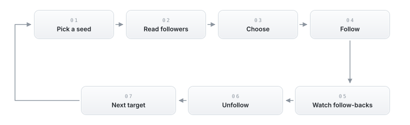

<p align="center">
  <picture>
    <source media="(prefers-color-scheme: dark)" srcset="project/assets/hero-dark.png">
    
  </picture>
</p>

<p align="center">
  <a href="../../releases/latest"></a>
  &nbsp;&nbsp;&nbsp;&nbsp;
  <a href="../../releases"></a>
</p>

<p align="center">
  Epo is a desktop app that grows your Instagram account for you. It follows people who
  are likely to follow back, waits, then unfollows. It runs slowly on purpose, inside
  limits you set, and shows you everything it does.
</p>

<br>

<p align="center">
  <picture>
    <source media="(prefers-color-scheme: dark)" srcset="https://raw.githubusercontent.com/owengregson/Epo/readme-live/charts/growth-dark.svg">
    
  </picture>
</p>

<p align="center">
  <sub>Simulated by the same growth model that ships in the app, on the default settings.
  Regenerated every night.</sub>
</p>

> **Before you start.** Tools like this one are against Instagram's terms of service.
> An account that runs one can be restricted or banned. Epo is careful by design, but
> the risk never reaches zero. Do not run it on an account you cannot afford to lose.

<br>

<p align="center">
  
</p>

<table>
<tr>
<td width="50%" valign="top">
<br>
<b>Your data stays on your computer</b><br>
No server, no sign-up. Everything Epo knows lives in one local database file you can
delete any time.
</td>
<td width="50%" valign="top">
<br>
<b>One action at a time</b><br>
Epo does one thing, waits a random delay, then does the next. It stays inside your
active hours and under your daily cap.
</td>
</tr>
<tr>
<td width="50%" valign="top">
<br>
<b>It knows when to stop</b><br>
Epo checks the page before every step. A checkpoint, challenge, or logout stops it
immediately, with the reason on screen.
</td>
<td width="50%" valign="top">
<br>
<b>Your own follows are safe</b><br>
Use Instagram normally while Epo runs. It works around what you do by hand and only
unfollows accounts it followed itself.
</td>
</tr>
<tr>
<td width="50%" valign="top">
<br>
<b>It picks up where it left off</b><br>
Quit the app, lose the connection, or let the laptop sleep — Epo pauses cleanly and
resumes where it stopped.
</td>
<td width="50%" valign="top">
<br>
<b>Watch it work</b><br>
The console shows the plan, the queues, and every action live as it happens.
</td>
</tr>
</table>

<br>

<p align="center">
  
</p>

Epo follows people who are likely to follow back, gives them time, then unfollows and
moves on. One pass looks like this:

<p align="center">
  <picture>
    <source media="(prefers-color-scheme: dark)" srcset="project/assets/diagrams/loop-dark.svg">
    
  </picture>
</p>

1. **Pick a seed.** An account in your niche whose followers would probably like yours too.
2. **Read.** Epo reads the seed's follower list into its local database, one page at a time.
3. **Choose.** It scores each profile and keeps active accounts inside the follower range you set.
4. **Follow.** One account at a time, each action written to a log.
5. **Watch.** It checks your newest followers on a schedule and marks who followed back.
6. **Unfollow.** Follow-backs are kept for a time you choose, then unfollowed. No
   follow-back means an earlier unfollow. Accounts with your protected bio words are
   never touched.
7. **Next.** When a seed runs dry, Epo moves to the next one in your chain.

You can keep using Instagram on any device the whole time. Epo notices what you did by
hand, fixes its own records to match, and never unfollows anyone you followed yourself.

<br>

<p align="center">
  
</p>

This chart is not a mock-up. A nightly job runs the same planner that ships in the app
and draws one real planned day, so it changes every night.

<p align="center">
  <picture>
    <source media="(prefers-color-scheme: dark)" srcset="https://raw.githubusercontent.com/owengregson/Epo/readme-live/charts/pace-dark.svg">
    
  </picture>
</p>

<p align="center">
  <sub>Each dot is one planned action. The band is the active-hours window. The dashed
  line is the daily cap.</sub>
</p>

<br>

<p align="center">
  
</p>

Volume and bursts are what get accounts flagged. The limits are built into the engine,
and the important ones can't be turned off:

| Limit | What it does |
|---|---|
| **One action per step** | The loop does at most one Instagram action per pass. |
| **Random delays** | A varied pause separates every action. |
| **Active hours** | Outside your window, Epo sleeps. |
| **Daily cap** | A hard limit per day. It survives restarts, and manual actions count too. |
| **Request budget** | Every call to Instagram is counted. When the budget is spent, Epo waits. |
| **Page check** | A checkpoint, challenge, or logout means an immediate stop, with the reason on screen. |
| **Instant controls** | Pause and Stop take effect immediately. |
| **Practice mode** | Runs the whole plan without doing anything real, so you can watch first. |

<br>

<p align="center">
  
</p>

1. **Download** the latest build for macOS or Windows from
   [the releases page](../../releases/latest).
2. **Open it.** Builds are unsigned for now. Mac: right-click → *Open* the first time.
   Windows: *More info* → *Run anyway*.
3. **Sign in once.** Epo opens Instagram's own sign-in page inside the app. The session
   is saved on your computer.
4. **Set your plan.** In *Settings*, pick a seed account and check the hours and caps.
   The defaults are careful.
5. **Press Start.** The console takes it from there.

<br>

<p align="center">
  
</p>

Everything is set in the app and survives a restart:

| Group | What you tune |
|---|---|
| **Seed and targets** | The seed account and the chain after it. |
| **Choosing** | The follower range Epo looks for. |
| **Pace** | Active hours, daily cap, request budget, and follow-back checks. |
| **Timing** | How long to wait for a follow-back, how long to keep one, and protected bio words. |
| **Practice mode** | Run the whole plan with no real actions. |
| **Data** | Reset settings, or erase everything and sign out. |

<br>

<p align="center">
  
</p>

**Does Epo need my Instagram password?**
No. You sign in on Instagram's own page inside the app. Your password never goes
anywhere else.

**Can my account still get banned?**
Yes. No tool can promise otherwise. Epo keeps volume low and stops when Instagram
pushes back — that lowers the risk, it doesn't remove it.

**How fast will I grow?**
Slowly, on purpose. Results build over weeks. Speed is what gets accounts flagged.

**Can I use Instagram normally while it runs?**
Yes, on any device. Epo works around what you do by hand.

**Does my computer have to stay on?**
Epo works while the app is open, inside your active hours. It pauses and resumes on
its own.

**Where does my data live?**
In one file on your computer. There is no Epo server and no analytics.

**What does it cost?**
Nothing. Open source, MIT license.

<br>

<p align="center">
  
</p>

| | |
|---|---|
| **Runs on** | macOS (Apple silicon and Intel) · Windows 10 and 11 |
| **Needs** | An Instagram account you own. No other software, no browser plug-ins. |
| **Talks to** | Instagram, and GitHub to check for updates. There is no Epo server. |
| **Your data** | One local SQLite file. *Settings → Clear all data* erases it and signs you out. |

<br>

<p align="center">
  
</p>

Epo is TypeScript end to end, strict mode, bundled by esbuild: an Electron shell
around a Preact renderer and an event-sourced SQLite store.

```
src/
  main/         Electron main process: window, IPC, wiring, connectivity
  renderer/     the Preact "Command Console" UI
  engine/       the paced runtime: scheduler, scanner, chain, follow-back watcher
  timing/       cadence: active hours, delays, per-cycle volume plans
  adapter/      version-marked Instagram surface (reader · actor · sentinel · versions/*)
  rim/          browser-facing ports: acquisition, page readers, reconciler, metering
  governors/    clock, rate governor, request budget
  interaction/  input dispatch that keeps working while the window is in the background
  store/        event-sourced SQLite knowledge graph: schema, migrations, projections
  settings/     durable settings
```

Three rules shape the code: facts are written to the store the moment they exist; the
UI redraws from store projections, which is why counts move mid-scan; and every
Instagram-specific literal lives in `src/adapter/versions/<date>.ts`, so a platform
change touches one dated file. The full set is in
[docs/PRINCIPLES.md](docs/PRINCIPLES.md).

Before a change is done, all four must pass:

```bash
npx jest             # unit suite: in-memory, no browser, no real timers
npx tsc --noEmit     # type-check
npm run lint         # biome
npm run build:dev    # bundle
```

DOM-level adapter changes also need `npm run livetest` against a real session.

Build and package:

```bash
npm start            # build and launch
npm run dist         # installable build under release/ (electron-builder)
npm run dist:mac     # macOS .dmg + .zip
npm run dist:win     # Windows installer + portable
```

CI type-checks, lints, tests, and builds every push; a `v*` tag builds the macOS and
Windows apps. Deeper notes live in [docs/](docs/): [PRINCIPLES.md](docs/PRINCIPLES.md),
[HANDOFF.md](docs/HANDOFF.md), and the adapter notes in [docs/adapter/](docs/adapter/).

Licensed [MIT](LICENSE).

<br>

<p align="center">
  
</p>

<p align="center"><sub><b>EPO</b> by <a href="https://github.com/owengregson">@owengregson</a></sub></p>
